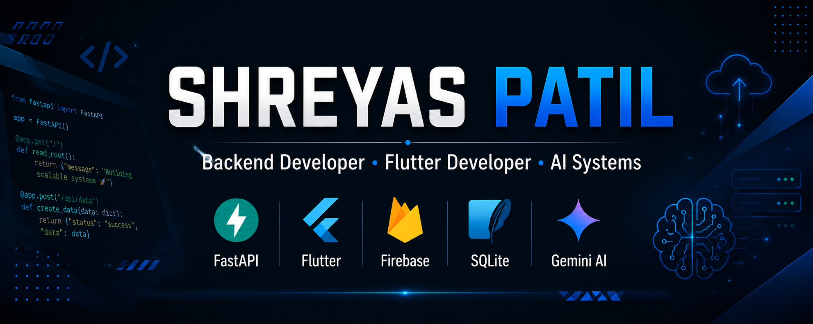

### Backend Developer • Flutter Developer • AI Systems

 

---

# About Me

Computer Engineering student passionate about building practical software solutions.

My primary focus is:

* Backend Development
* AI-Powered Applications
* Flutter App Development
* Database Design
* Secure Authentication Systems
* Performance Optimization

I enjoy transforming ideas into production-ready applications with clean architecture, scalability, and maintainability in mind.

---

# Tech Stack

### Languages

### Backend

### Mobile

### Databases

### Tools

Git • GitHub • Postman • Render • Vercel

---

# Featured Projects

## 🎓 UNIFIND

AI-powered student marketplace platform.

### Highlights

* FastAPI Backend
* Firebase Firestore
* Gemini AI Integration
* JWT Authentication
* Semantic Search
* Secure REST APIs
* Performance Optimized Backend

🔗 Repository:
https://github.com/Shreyas-patil07/UNIFIND

---

## 🎮 Gaming Cafe Manager

Offline-first Flutter application for gaming cafes.

### Highlights

* Flutter + SQLite
* Real-Time Session Tracking
* Revenue Analytics
* Queue Management
* Offline-First Architecture
* Business Reporting Dashboard

🔗 Repository:
https://github.com/Shreyas-patil07/gaming_cafe_manager

---

# Achievements

🏆 1st Place — Techskills × RKDemy Hackathon

🏆 Built UNIFIND with Team Numero Uno

🏆 Designed and developed backend architecture for production deployment

---

# GitHub Stats

---

# Current Focus

* FastAPI
* Flutter
* AI Integration
* Backend Architecture
* Database Systems
* Cloud Deployment

---

# Connect

📧 [3shreyas2007@gmail.com](mailto:3shreyas2007@gmail.com)

💼 LinkedIn:
https://linkedin.com/in/shreyasrp07

🐙 GitHub:
https://github.com/Shreyas-patil07

---

> Building software that solves real-world problems.
